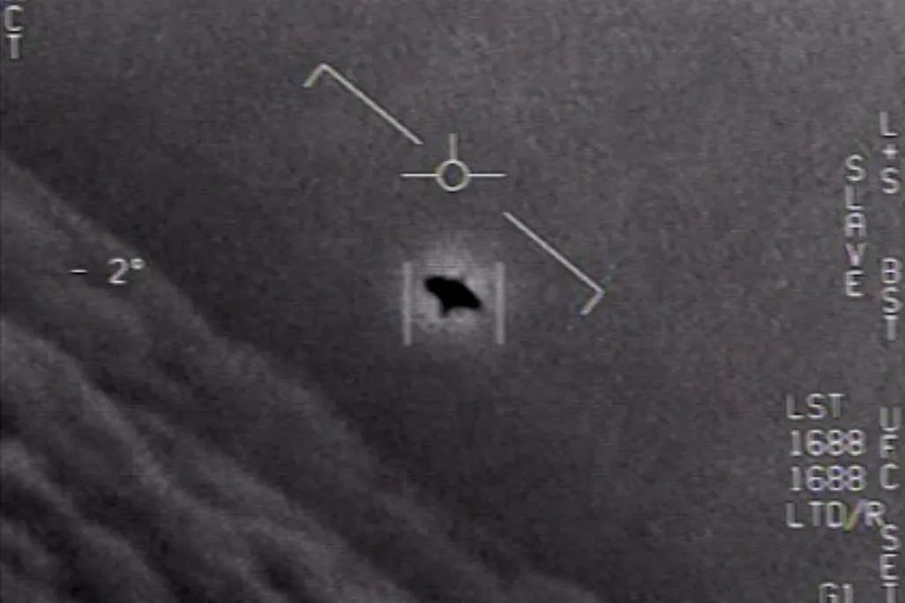
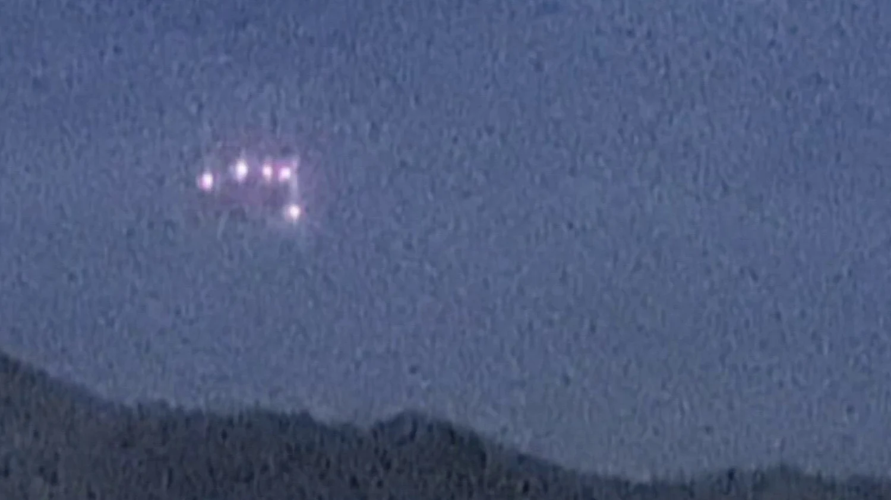

```{r setup, include=FALSE}
knitr::opts_chunk$set(
  echo    = TRUE,    
  message = FALSE,    
  warning = FALSE,    
  fig.width  = 7,
  fig.height = 4.5,
  fig.align  = "center"
)
```

```{r packages}
library(ggplot2)
library(dplyr)
library(gridExtra)
library(grid)
library(kableExtra)
library(RColorBrewer)
library(ggrepel)
library(ggthemes)
library(viridis)
library(ggridges)
library(tidyverse)
library(lubridate) #for the mdy()
```

```{r load-data}
#dataset 1

ufo_data <- read.csv("ufo_data.csv")
new_ufo <- ufo_data %>% select("datetime", "city", "state", "country", "shape", "duration..seconds.", "latitude", "longitude") %>% 
  mutate(across(where(is.character), trimws)) %>% #filtering the white spaces 
  filter(if_all(everything(), ~ . != "")) %>% 
  na.omit() %>% 
  separate(col=datetime, into = c("date", "time"), sep = " ")

# Adding new data set and changing strings to numeric values for data manipulation
ufo_sighting_data <- read.csv('ufo_sighting_data.csv',sep=',',stringsAsFactors=F)
df <- ufo_sighting_data %>%
  mutate(country = case_when(
    is.na(country) ~ "none",
    country == ""  ~ "none",
    TRUE ~ country
  ))

df$latitude <- as.numeric(df$latitude)

dt <- mdy_hm(df$Date_time)

df$year  <- year(dt)
df$month <- month(dt)
df$day   <- day(dt)
df$hour  <- hour(dt)
df$hour  <- ifelse(df$hour == 24, 0, df$hour)
df$min   <- minute(dt)

df$month_name <- month(dt, label = FALSE, abbr = FALSE)
df$month_name_ordered <- factor(df$month_name, levels = month.name)

df$DATE   <- date(dt)
df$DATE_2 <- as.Date(df$DATE)

df$weekday <- factor(wday(dt, label = TRUE, abbr = TRUE, week_start = 1),
                     levels = c("Mon", "Tue", "Wed", "Thu", "Fri", "Sat", "Sun"))

df$length_min <- as.numeric(df$length_of_encounter_seconds) / 60

#Theme to help graphs fit better
blank_theme <- theme_fivethirtyeight()+
  theme(
  axis.title.x = element_blank(),
  axis.title.y = element_blank(),
  panel.border = element_blank(),
  panel.grid=element_blank(),
  axis.ticks = element_blank(),
  plot.title=element_text(size=14, face="bold")
  )
```

---

# Introduction

If you can’t name it, it might just be an unidentified flying object. Have you ever stopped to wonder why we’re so fascinated by UFOs in the first place? As humans, we’re wired for curiosity and love turning mysteries into stories, theories, and yes—full‑on tinfoil‑hat conspiracies. It’s time to lean into that curiosity and actually investigate. 

What are these UFOs? Are E.T. and his friends real? Are they just making a pit stop on good old oil‑rich Earth for a quick refuel? The real challenge is figuring out where these crafts tend to show up so we have the best shot at actually interacting with them. After all, who wouldn’t want to hitch a ride across the universe with E.T. and hear all their cosmic secrets? 

To address these questions, we will be looking at two similar data sets:

 - **ufo_data.csv** - Our original data set that was removed from Kaggle during initial analysis.
 - **ufo_sighting_data.csv** - A similar data set with additional entries. 
 
In this analysis, we’ll hunt for potential UFO “hotspots” on Earth—places where sightings cluster—so you could, in theory, grab some friends, camp out, and go UFO‑watching in high‑probability zones. 
 
 
```{r, echo=FALSE, fig.align='center', out.width='60%'}

```

---

# The questions twe seek answers for:

 - What locations have the greatest volume of extraterrestrial reports?
 - What time of year are extraterrestrial sightings reported the most?
 - Is there a particular time of day that extraterrestrial sightings occur?
 - What type of objects should you be on the look-out for?

---

# About the Dataset

## Data Source

The data is based on Extraterrestial Reports from 1910-2009. It shows location, time, shapes of the extraterrestial, and brief descriptions of the event.

- [Link to UFO Sightings Around the World](https://www.kaggle.com/datasets/camnugent/ufo-sightings-around-the-world)

## Tools Used

In order to more easily register and analyze the information provided by our data set, we used the following tools to aid in organization and visualization:

 - dplyr - used for efficient data manipulation
 - ggplot2 - used for creating helpful visualizations that conveyed our found data
 - ggridges - helped with creating ridgeline plots
 - ggrepel - helped with automatically repelling overlapping text on figures
 - ggthemes - for some additional, visually appealing themes
 - grid - useful for creating some more complex plots that required positioning
 - gridExtra - helped with combining multiple plots onto one surface
 - lubridate - made conversions of strings to integers much more efficient
 - RColorBrewer - for visually appealing color schemes
 - tidyverse - helped clean and tidy information
 - viridis - added some additional color themes

By analyzing our data with these methods, we believe we can accurately ascertain the prime location for extraterrestrial encounters. By the end, you should feel comfortable with booking a hotel room at one of our recommendations and waiting for an out-of-this-world experience.

```{r glimpse}
glimpse(df)
```

# Is There a Reason We Should Care?

 - Aliens are cool!
 - Wouldn't you like to find out the best vacation locale to meet up with some?
 - Also, where are these reports even originating from? Maybe you don't want to risk being abducted!


# Key Terms and Column Focus 

 - Country abbreviations
   - au - Australia
   - ca - Canada
   - de - Germany
   - gb - Great Britain
   - us - United States
 - State abbreviations
   - Too many to list!
 - Lat/Lon will be critical for our locating needs on the map!
 - Time of day, day, and month will be pertinant for determining the best season to find E.T.!
 - UFO Shape: Describes the Manifestation of E.T. sighting
 
 
# Overview of Data and Where 

```{r echo=FALSE, message=FALSE, warning=FALSE}
df %>% 
  group_by(year,country) %>% 
  summarize(count=n()) %>%
  ggplot(aes(x = year, y = count, fill = country)) + 
  geom_histogram(stat='identity',width=1,color='white',size=.25) + 
  scale_fill_brewer(palette='Paired', labels = c(
    "none" = "No Origin", 
    "au" = "Australia", 
    "ca" = "Canada", 
    "de" = "Germany", 
    "gb" = "UK", 
    "us" = "USA")) + 
  geom_vline(xintercept=1990,color='black') + 
  annotate("text", x = 1975, y = 6000, label = "Internet Access\nto General Public",color='black') + 
  theme_fivethirtyeight() + 
  ggtitle('UFO Sightings Overview by Year and Location', 'NA, Australia, Canada, Germany, Great Britain, United States') +
  theme(legend.position='right',legend.direction='vertical')
  
```

 - With a quick overview, we can see that most reports do not actually occur until after ~1995.
 - We believe this is most likely attributed to the lack of public internet access before then.
 - It also looks like the US has an overwhelming number of reports!


# Worldwide View

```{r echo=FALSE, warning=FALSE}
countries_map <- map_data("world")
world_map <- ggplot() + 
  geom_map(data = countries_map, 
           map = countries_map,aes(x = long, y = lat, map_id = region, group = group),
           fill = "white", color = "green", size = 0.1)

world_map + geom_point(data=df,aes(x=longitude,y=latitude),alpha=.5,size=.25) + theme_fivethirtyeight() + ggtitle('Locations of UFO Sightings')
```

 - Here is a broader-scope view of reports around the world.
 - Let's check for density readings!
 
# Density Plot
```{r echo=FALSE, warning=FALSE}
world_map +
  geom_density_2d_filled(
    data = df,
    aes(x = longitude, y = latitude),
    alpha = 0.6,
    contour_var = "ndensity"
  ) +
  coord_quickmap() +
  scale_fill_viridis_d(name = "Density") +
  theme_fivethirtyeight() +
  ggtitle("Density of UFO Sightings")
```

 - Just as our overview promised...
 - As we can see, there appears to be a conglomerate of reports focused in the United States.
 - Let's take a closer look...


# United States View 

```{r echo=FALSE, warning=FALSE}
states_map <- map_data("state")

usMap <- ggplot() + 
  geom_map(data = states_map, map = states_map,aes(x = long, y = lat, map_id = region, group = group),fill = "white", color = "green", size = 0.1) + 
  theme_fivethirtyeight()

usMap + 
  geom_point(data=filter(df,country=='us' & state.province!='hi' & state.province!='ak' & state.province!='pr'),aes(x=longitude,y=latitude),alpha=.75,size=.5) + 
  ggtitle('Location of UFO Sightings in the US')


```
 
 - Our initial thought was that most reports would come out of the rural midwest.
 - It appears that might not be the case. Maybe a density plot will help us understand where the focus of reports are...
 
 
# United States Density

```{r echo=FALSE, warning=FALSE}
usMap + 
  geom_density_2d_filled(
    data = df %>% 
      filter(country == 'us',
             !state.province %in% c('hi','ak','pr'),
             !is.na(longitude), !is.na(latitude)),
    aes(x = longitude, y = latitude),
    alpha = 0.7,
    contour_var = "ndensity"
  ) +
  scale_fill_viridis_d(name = "Density") +
  ggtitle("Density of UFO Sightings in the US")

```

 - Looks like we have some pretty strong contenders in all four corners of the country.
 - Let's see if we pull the numbers whether or not that matches.
 

# Top Counts in the States

```{r echo=FALSE, warning=FALSE}
df %>%
  filter(!is.na(state.province)) %>%   # remove NA upfront
  count(state.province, sort = TRUE) %>%
  slice_head(n = 6) %>%
  mutate(state_full = state.name[match(toupper(state.province), state.abb)]) %>%
  filter(!is.na(state_full)) %>%       # safeguard: drop anything not matched
  ggplot(aes(x = reorder(state_full, n), y = n, fill = state_full)) +
  geom_col() +
  theme_bw() +
  theme(
    axis.text.x = element_text(angle = 50, size = 9, hjust = 1),
    legend.position = "none"
  ) +
  xlab("State") +
  ylab("Number of Reports") +
  ggtitle("Top 5 States for UFO Sightings in the USA")
```

 - Whoa! What's going on in California that E.T. is so into?
 

# Coachella, maybe?

```{r, echo=FALSE, fig.align='center', out.width='60%'}

```


# So Far...

 - Okay, so we know that we're already living in the country filled with the most sightings of E.T. activity. That's great!
 - Fortunately, Texas is also in the top rankings!
 - This is only a part of the story, though. When is also impornant to know!
 
 
# First, let's look at the seasons!

```{r echo=FALSE, warning=FALSE}
df %>%
  filter(country == "us", !is.na(hour), !is.na(month)) %>%
  mutate(
    season = case_when(
      month %in% c(12, 1, 2)  ~ "Winter",
      month %in% c(3, 4, 5)   ~ "Spring",
      month %in% c(6, 7, 8)   ~ "Summer",
      month %in% c(9, 10, 11) ~ "Fall"
    )
  ) %>%
  mutate(season = factor(season, levels = c("Winter","Spring","Summer","Fall"))) %>% 
  count(hour, season) %>%
  ggplot(aes(x = hour, y = n, color = season)) +
  geom_line(size = 1) +
  geom_point(size = 1.5) +
  scale_x_continuous(breaks = 0:23) +
  theme_bw() +
  xlab("Hour of Day") +
  ylab("Number of Sightings") +
  ggtitle("UFO Sightings by Time of Day (US) Across Seasons") +
  labs(color = "Season")
```

 - Well, it seems pretty obvious that E.T. really hates the cold.
 - These are human-reported...
 - Maybe we hate the cold?

# Top states and Seasons 

```{r echo=FALSE, warning=FALSE}
season_state_ufo <- new_ufo %>%
  mutate(
    date = parse_date_time(date, orders = c("mdy", "ymd", "dmy", "mdy HM", "ymd HM")),
    month_num = month(date),
    season = case_when(
      month_num %in% c(12, 1, 2)  ~ "Winter",
      month_num %in% c(3, 4, 5)   ~ "Spring",
      month_num %in% c(6, 7, 8)   ~ "Summer",
      month_num %in% c(9, 10, 11) ~ "Fall"
    )
  ) %>%
  filter(country == "us") %>%        #focusing on the united states 
  count(season, state, name = "n") %>%
  group_by(season) %>%
  slice_max(n, n = 5)               #top 10 states per season

ggplot(season_state_ufo, aes(x = reorder(state, n), y = n, fill = season)) +
  geom_col(color="black", show.legend = FALSE) +
  coord_flip() +
  facet_wrap(~ season, scales = "free_y") +
  scale_fill_manual(values = c(
    "Winter" = "blue",
    "Spring" = "green",
    "Summer" = "red",
    "Fall"   = "yellow"
  )) +
  labs(
    title = "Top 5 States for UFO Sightings by Season in the United States",
    x = "State",
    y= "Number of Sightings"
  ) +
  theme_minimal()

```

 - So California's perfect weather might be causing the data to pull ahead for them.
 - Let's try another look:
 
 
# Line Plot

```{r echo=FALSE, message=FALSE, warning=FALSE}
df %>%
  filter(
    country == "us",
    state.province %in% c("ca", "ny", "fl", "wa", "tx"),
    !is.na(hour),
    !is.na(month)
  ) %>%
  mutate(
    state = toupper(state.province),
    season = case_when(
      month %in% c(12, 1, 2)  ~ "Winter",
      month %in% c(3, 4, 5)   ~ "Spring",
      month %in% c(6, 7, 8)   ~ "Summer",
      month %in% c(9, 10, 11) ~ "Fall"
    ),
    season = factor(season, levels = c("Winter","Spring","Summer","Fall"))
  ) %>%
  count(state, hour, season) %>%
  ggplot(aes(x = hour, y = n, color = season)) +
  geom_line(size = 1) +
  scale_x_continuous(breaks = seq(0, 23, by = 4)) +
  facet_wrap(~state, ncol = 2) +
  theme_bw() +
  labs(
    x = "Hour of Day",
    y = "Number of Sightings",
    color = "Season",
    title = "UFO Sightings by Time of Day Across Seasons",
    subtitle = "California, New York, Florida, Washington, Texas"
  ) +
  scale_color_brewer(palette = "Set2")

```

 - The season definitely plays a factor.
 - Less-so for Florida and Texas, it seems. The weather there is likely static for most of the year barring a handful of days.
 
 
# What Day of the Week?

```{r echo=FALSE, message=FALSE, warning=FALSE}
df %>%
  filter(country == "us", !is.na(DATE_2)) %>%
  mutate(
    weekday = wday(DATE_2, label = TRUE, abbr = TRUE, week_start = 1)
  ) %>%
  count(weekday) %>%
  ggplot(aes(x = weekday, y = n, group = 1)) +
  geom_line(color = "green", size = 1) +
  geom_point(color = "black", size = 2) +
  theme_bw() +
  xlab("Day of Week") +
  ylab("Number of Sightings") +
  ggtitle("UFO Sightings by Day of Week")

```

 - Looks like the weekends reign supreme here.
 - Does this trend apply to all of our top state contenders?
 
 
# Day of the Week by States

```{r echo=FALSE, message=FALSE, warning=FALSE}
df %>%
  filter(
    country == "us",
    state.province %in% c("ca", "ny", "fl", "wa", "tx"),
    !is.na(DATE_2)
  ) %>%
  mutate(
    state = toupper(state.province),
    weekday = wday(DATE_2, label = TRUE, abbr = TRUE, week_start = 1)
  ) %>%
  count(state, weekday) %>%
  ggplot(aes(x = weekday, y = n, group = state)) +
  geom_line(color = "green", size = 1) +
  geom_point(size = 1.5) +
  facet_wrap(~state, ncol = 2) +
  theme_bw() +
  xlab("Day of Week") +
  ylab("Number of Sightings") +
  ggtitle("UFO Sightings by Day of Week")
```

 - This trend does seem mostly applicable!
 - Some states more than others.
 
 
# Brief Summary:

 - Okay, so we have the U.S.
 - We know E.T. is a fan of Texas, Cali, Florida, New York, and Washington...
   - The most populated states?
 - E.T. HATES the cold weather. Perhaps that's why the southern states are among the highest in reports.
 - They also love to come out during the weekend.
   - Especially Saturday!
  

# Okay, so...

 - We have our California hotel booked for a nice summer weekend... but when should we be keeping watch?
 
 
# Day or Night 

```{r echo=FALSE, warning=FALSE}

ca_summer_tod <- new_ufo %>%
  mutate(
    date = parse_date_time(date, orders = c("mdy", "ymd", "dmy")),
    hour= as.integer(substr(time, 1, 2)),  # getting the  hour from the time var string
    time_of_day = case_when(
      hour >= 6 & hour < 20~ "Daytime",
      TRUE~ "Nighttime"
    ),
    month_num   = month(date),
    season      = case_when(
      month_num %in% c(12, 1, 2) ~ "Winter",
      month_num %in% c(3, 4, 5)  ~ "Spring",
      month_num %in% c(6, 7, 8)  ~ "Summer",
      month_num %in% c(9,10,11)  ~ "Fall"
    )
  ) %>%
  filter(country == "us", state == "ca", season == "Summer") %>%
  count(time_of_day, name = "n")


ggplot(ca_summer_tod, aes(x = time_of_day, y = n, fill = time_of_day)) +
  geom_col(color = "black", show.legend = FALSE) +
  scale_fill_manual(values = c(
    "Daytime"   = "gold",
    "Nighttime" = "navy"
  )) +
  labs(
    title = "UFO Sightings by Time of Day in California (Summer)",
    subtitle = "Daytime is from 6AM to 8PM",
    x = "Time of Day",
    y= "Number of Sightings"
  ) +
  theme_minimal()
```

 - A quick overview makes it clear that E.T. is either shy or burns easily.
 

# Okay, so now that we have that settled, what exactly should we keep an eye out for?

```{r echo=FALSE, warning=FALSE}
ggplot(df, aes(x=reorder(UFO_shape, UFO_shape, FUN=length), fill=UFO_shape)) + 
  geom_bar(show.legend=F) +
  coord_flip() +
  theme_bw() + xlab("UFO Shape") + ylab("Number of Appearances") + ggtitle("UFO Shapes Seen Worldwide");

```

 - Light? At night? Well, that could be anything!
 - Let's look at some examples of the most common just so we have an idea.
 
 
# Here are some examples:
```{r, echo=FALSE, fig.align='center', out.width='60%'}

```

```{r, echo=FALSE, fig.align='center', out.width='60%'}

```

```{r, echo=FALSE, fig.align='center', out.width='60%'}

```

```{r, echo=FALSE, fig.align='center', out.width='60%'}

```

 
 
# Okay, maybe there is some correlation between the time of day and what shape tends to appear... 

```{r echo=FALSE, warning=FALSE}
df %>%
  filter(
    country == "us",
    !is.na(hour)
  ) %>%
  ggplot(aes(
    x = reorder(UFO_shape, hour, FUN = median),
    y = hour
  )) +
  geom_boxplot(fill = "green", outlier.alpha = 0.3) +
  coord_flip() +
  scale_y_continuous(breaks = 0:23) +
  theme_bw() +
  xlab("UFO Shape (Top 10 Most Common)") +
  ylab("Hour of Day (0–23)") +
  ggtitle("Do UFO Shapes Appear at Different Times of Day? (US)")

```

 - Well, not quite.
 - Fireballs do seem much more focused on happening at night, though!


# Maybe a quick look at how long we have to notice these manifestations...

```{r, echo=FALSE, message=FALSE, warning=FALSE}
shape_summary <- df %>%
  filter(
    !is.na(UFO_shape),
    UFO_shape != "",
    !is.na(length_min)
  ) %>%
  group_by(UFO_shape) %>%
  summarize(
    count = n(),
    avg_duration_minutes = ceiling(mean(length_min, na.rm = TRUE))
  ) %>%
  arrange(desc(count))

shape_summary
```

 - Well... that can't be right...
 - Why are there such large gaps?
 

# That makes sense...

```{r echo=FALSE, warning=FALSE}
df %>% filter(length_min>1e6) %>% 
  select(-c(length_of_encounter_seconds,DATE_2,description,year, month, day ,hour, min, month_name, month_name_ordered,state.province))
```

 - 21 years?


# Let's shave off a lot of that excess percentile and see what we end up with...

```{r echo=FALSE, warning=FALSE}
cutoff <- quantile(df$length_min, 0.99, na.rm = TRUE)

shape_summary <- df %>%
  filter(
    !is.na(UFO_shape),
    UFO_shape != "",
    !is.na(length_min),
    length_min <= cutoff
  ) %>%
  group_by(UFO_shape) %>%
  summarize(
    count = n(),
    avg_duration = ceiling(mean(length_min))
  ) %>%
  arrange(desc(count))

shape_summary

```

 - Perfect! Much more reasonable.
 
 
# Well, I think we've uncovered some decent information in determining where to meet up with our new BFF E.T.

 - Make sure you book your trip for the summertime.
 - Your best bet is going to be in Texas, Florida, New York, Washington, or California...
   - We're betting on California, though.
 - E.T. must not know about suntan lotion, so plan to pull an all-nighter over the weekend.
 - And lastly, keep an eye out for abnormal lights!
   - Maybe E.T. is into the California rave scene...
  
  
# To infinity...

```{r, echo=FALSE, fig.align='center', out.width='60%'}

```
# Data:
- Display and Summary:

# Exploratory Data Analysis
- Discovery
- plots/graphs/tables
- explanation

# Summary
- problem and insights
- implication and limitations
- formatting and other requirements

We always hear about controversies and tinfoil hats, but we were curious how often do those from space come to visit, if at all? Is Earth a local hotspot for E.T. and his friends? Is Coachella a galaxy-wide attraction? These questions felt fun to dive into and answer.